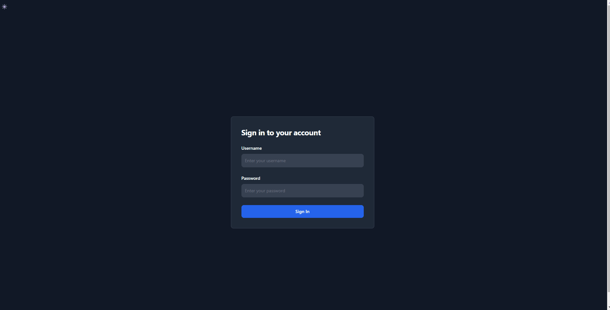

# qPCR-auto
## Work in progress

This is a Python/Javascript web app serving to streamline longitudinal, lab-specific experiments measuring quantitative polymerase chain reaction (qPCR) data. The goal of this app is to standardize data processing and visualization; assay and rank experiment quality; and provide timeline tracking. 

Raw qPCR data is mass-analyzed to provide statistical (pandas, polars, pyjanitor, NumPy) and visual (Chart.js Seaborn) insights - recording experimental history and powering functional alerts to inform scientific decision-making in ensuring experimental quality.

## Projected
* Scalable and efficient server API using Flask (Python 3.8)
* Responsive user experience with Vanilla JS & Chart.js (ES6)
* Sleek and modern design & styling with Tailwind CSS (3.0) and Flowbite
* Seamless cloud integration with Google Cloud

## Current state:

