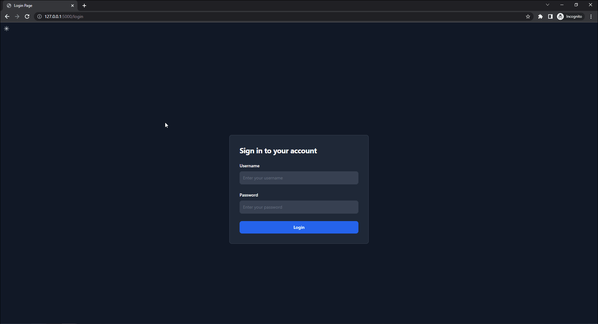

# qPCR-auto

A Python/Javascript web app designed to streamline longitudinal, lab-specific experiments measuring quantitative polymerase chain reaction (qPCR) data. The goal of this app is to standardize data processing and visualization; assay and rank experiment quality; and provide timeline tracking.

## Features

- Scalable and efficient server API using Flask (Python 3.9)
- Responsive user experience with Vanilla JS (ES6)
- Sleek and modern design & styling with Tailwind CSS (3.0) and Flowbite
- Custom SVG illustrations with Adobe Illustrator
- Seamless cloud integration with Google Cloud

## Purpose and used libraries
- Rapid analysis of raw qPCR data for statistical and visual insights
- Utilizes powerful libraries like Pandas, Polars, Pyjanitor, NumPy, Chart.js, and Seaborn
- Records experimental history to aid scientific decision-making
- Functional alerts for maintaining experimental quality

## Current State



## Getting Started

### Prerequisites

- Python 3.9
- Node.js

### Installation

1. Clone the repository

```bash
git clone https://github.com/ivankoros/qPCR-auto.git
```
2. Install Python dependencies
```python
pip install -r requirements.txt
```

3. Install Javascript dependencies
```
npm install
```

4. Run the development server
```
npm run start
```

## Running Tests

To ensure the functionality of the Flask app, I've implemented unit for ever funciton through Python's unittests and patch tests (found in tests/tests.py). Follow these steps to run the tests:

### Prerequisites

- For refrence, your test files test files (incorrect_raw_counts.xlsx, correct_plate_diagram.xlsx, and correct_raw_counts.xlsx) are placed in the `tests/testfiles` folder.

### Running the Tests

1. Ensure you are in the root directory of the project.

2. Run the tests

```python
python -m unittest tests/tests.py
```

The tests will be executed, and you will see the results in your terminal. The tests cover ever function in the Flask app, such as login, registration, file upload, and file validation.

## Contributing

Pull requests are welcome! For major changes, please open an issue first to discuss what you would like to change.

## License

[MIT License](https://choosealicense.com/licenses/mit/)


